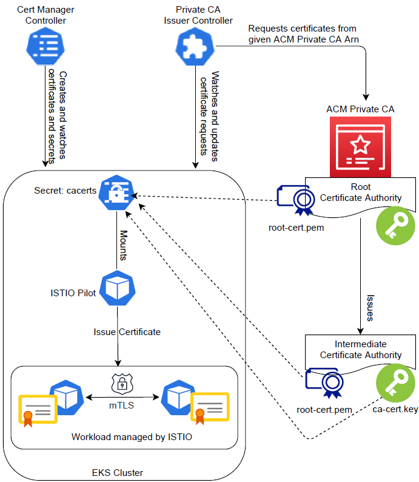

This section will walk you through the steps required to integrate the AWS ACM (Amazon Certificate Manager) Private CA service with ISTIO so that you can issue certificates from ACM Private CA to your ISTIO workload rather than using the self-signed root certificate that ISTIO generates by default.

Instead of using a self-signed root certificate, here we get an intermediary ISTIO certificate authority (CA) from AWS ACM Private CA service to sign the workload certificates. For a production cluster setup, it is highly recommended to use a production-ready CA, such as ACM Private CA. It is good practice to manage the root CA on an external service with strong security protection.

This approach enables the same root of trust for the root CA’s workloads in ACM Private CA. As ISTIO signs the workload certs, the latency for getting workload certs issued is far less than directly getting the certs signed by ACM Private CA itself.

The ```getmesh gen-ca``` command furnishes the options to connect to ACM Private CA and get the intermediary CA cert signed. It uses the certificate details thus obtained to create the cacerts Kubernetes secret for Istio to use to sign workload certs. ISTIO, at startup, checks for the presence of the secret cacerts to decide if it needs to use this cert for signing workload certificates.

SSL/TLS certificates are required to encrypt connections and identify resources because you and your services must connect securely to those websites, applications, load balancers, and service meshes.

We will issue a private certificate to an ISTIO Ingress Gateway using the AWS ACM Private CA service. When you use ACM Private CA, you can put strong iam protection around that certificate authority as well as monitor and audit it.

## Limitations 

* This only applies to the issuance of certificates for internal workloads running in Kubernetes namespaces managed by ISTIO Service Mesh, not for workloads that must be accessible publicly on the internet.
* We'll proceed under the assumption that you're deploying your cluster using EKS Blueprints. If not, you can deploy the required addons on your own and essentially follow the same steps.
* We are using an example from the EKS Blueprints. Feel free to modify it, use another, or, if you want, create your own.


## Target architecture 

The following architecture provides an overall picture of the solution described here.


Upon ISTIO installation, ISTIO creates a CA to sign the certificates. This generated CA is stored in the Istio installation namespace as a secret named istio-ca-secret and is shared with istiod replicas. The default behavior can be overridden by plugging in our CA (ACM Private CA), which Istio CA uses rather than creating a new one. To do so, we must save the CA certificates in the installation namespace istio-system as a secret named cacerts, which contains the following information:

* ca-cert.pem—The certificate of the intermediate CA.
* ca-key.pem—The private key of the intermediate CA.
* root-cert.pem—The certificate issued by the root CA to the intermediate CA. The root CA validates certificates issued by any of its intermediate CAs, which is critical for cluster trust.
* cert-chain.pem—The trust chain is formed by the concatenation of the intermediate CA's certificate and the root CA's certificate.

Once this secret is attached to the ISTIO pilot, it will be ready to issue certificates to ISTIO-managed pods. We will be automating this process in the following section.
